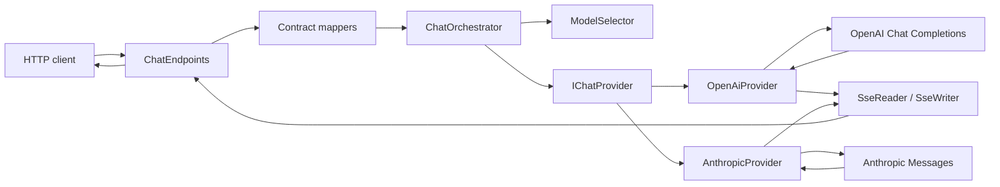

# Tài liệu kiến trúc

## Mục đích

Proxy Agent là HTTP gateway trên .NET 10, cung cấp một lớp gọi hội thoại thống nhất cho OpenAI và Anthropic. Gateway nhận request từ client, chọn provider theo model, chuyển đổi payload giữa các API, rồi trả response JSON hoặc stream SSE.

Trong MVP, Anthropic được gọi qua Messages API. Gateway không chạy tiến trình Claude Code CLI và không tự thực thi tool.

## Sơ đồ tổng quát



## Các tầng và trách nhiệm

### API layer

`src/ProxyAgent.Api/Api` chứa route và DTO bên ngoài:

- `ChatEndpoints.cs`: định nghĩa `/api/chat` và `/v1/chat/completions`.
- `GatewayContracts.cs`: schema normalized của gateway.
- `OpenAiContracts.cs`: schema tương thích OpenAI, bao gồm tên field snake_case.
- `ErrorHandling.cs`: đổi exception nội bộ thành HTTP status và error envelope ổn định.

Endpoint không gọi `HttpClient` trực tiếp. Nó chỉ map request, gọi orchestrator và serialize kết quả.

### Application/orchestration layer

`src/ProxyAgent.Api/Chat` chứa model chung và routing:

- `ChatModels.cs`: `NormalizedChatRequest`, `ChatMessage`, `ChatTool`, `ChatToolCall`, response và stream event.
- `ModelSelector.cs`: xử lý `openai:...`, `anthropic:...`, provider mặc định và model mặc định.
- `ChatOrchestrator.cs`: resolve provider từ `IChatProvider`, sau đó gọi `CompleteAsync` hoặc `StreamAsync`.

Layer này không biết payload wire format của OpenAI hoặc Anthropic.

### Provider/infrastructure layer

`src/ProxyAgent.Api/Providers` triển khai port `IChatProvider`:

- `OpenAiProvider.cs`: gọi `{BaseUrl}/chat/completions`, Bearer authentication, map Chat Completions response và stream chunk.
- `AnthropicProvider.cs`: gọi `{BaseUrl}/messages`, dùng `x-api-key`/`anthropic-version`, tách system message và map content blocks.
- `OpenAiPayloads.cs` và `AnthropicPayloads.cs`: DTO chỉ dành cho wire format upstream.
- `ProviderExceptions.cs`: phân loại provider chưa cấu hình, auth failure, request failure và upstream unavailable.

Mỗi provider dùng typed/named `HttpClient` được đăng ký trong `Program.cs`. API key không được ghi vào log.

### Streaming layer

`SseReader` đọc các event SSE từ upstream, hỗ trợ `event:`, nhiều dòng `data:` và event phân cách bằng dòng trống.

`SseWriter` chuyển normalized `ChatStreamEvent` thành:

- OpenAI chunk với `object: "chat.completion.chunk"`, kết thúc bằng `data: [DONE]`.
- Gateway event với `type: "delta"`, `type: "done"` hoặc `type: "error"`.

Cancellation từ `HttpContext.RequestAborted` được truyền xuống stream provider.

## Luồng request không streaming

1. Client gửi request vào một trong hai route.
2. Contract mapper kiểm tra message role và đổi DTO thành `NormalizedChatRequest`.
3. `ModelSelector` đọc model prefix:
   - `openai:gpt-4o-mini` → provider `openai`, model `gpt-4o-mini`.
   - `anthropic:claude-sonnet-4-5` → provider `anthropic`, model `claude-sonnet-4-5`.
4. `ChatOrchestrator` tìm provider tương ứng.
5. Provider map normalized request sang wire payload và gọi upstream.
6. Provider map response về `NormalizedChatResponse`.
7. Endpoint map normalized response về contract của route.

## Luồng streaming

Request vẫn dùng `stream: true`. Provider mở upstream response với `ResponseHeadersRead`, đọc từng SSE event và yield `ChatStreamEvent`.

Endpoint ghi mỗi event ngay vào response và flush. Với OpenAI-compatible route, event `IsDone` được đổi thành `[DONE]`; với gateway route, event done được ghi thành JSON event.

Nếu lỗi xảy ra trước khi response bắt đầu, gateway trả HTTP error bình thường. Nếu stream đã bắt đầu, gateway ghi một SSE error event rồi đóng stream vì HTTP status không còn thay đổi được.

## Tool calling

Đây là client-side tool calling:

```text
Client gửi tools
    -> model trả tool call
    -> gateway trả tool call cho client
    -> client tự thực thi tool
    -> client gửi role=tool/tool result ở request kế tiếp
```

Mapping chính:

| Normalized | OpenAI | Anthropic |
|---|---|---|
| Tool definition | `tools[].function.parameters` | `tools[].input_schema` |
| Assistant call | `tool_calls` | `tool_use` block |
| Tool result | message `role: tool` | `tool_result` block trong message user |

Gateway không có tool registry và không thực thi shell, file system hay HTTP tool nào.

## Routing và configuration

`Program.cs` bind hai section `Routing` và `Providers`, đăng ký cả hai provider, đồng thời cấu hình timeout HTTP.

Model selector dùng quy tắc:

1. Prefix `openai:` hoặc `anthropic:` có ưu tiên cao nhất.
2. Model không có prefix dùng `Routing:DefaultProvider`.
3. Model rỗng dùng `DefaultModel` của provider được chọn.
4. Provider chưa đăng ký trả `503 provider_not_configured`.

Base URL là API root; provider tự nối path resource:

```text
OpenAI:    {BaseUrl}/chat/completions
Anthropic: {BaseUrl}/messages
```

## Error model

Response lỗi có dạng:

```json
{
  "error": {
    "code": "provider_unavailable",
    "message": "The upstream provider is unavailable.",
    "provider": "openai"
  }
}
```

Các mã chính: `invalid_request`, `unsupported_provider`, `provider_not_configured`, `provider_authentication_failed`, `provider_request_failed`, `provider_unavailable`.

## Testing architecture

Test project dùng ba lớp kiểm tra:

- Unit tests cho model selector, provider mapping và SSE parser/writer.
- Provider tests dùng `HttpMessageHandler` giả để kiểm tra request/response mà không gọi mạng thật.
- Endpoint tests dùng `WebApplicationFactory` và `FakeChatProvider` để kiểm tra routing, response shape, streaming và error status.

Không test nào cần API key thật.

## Giới hạn MVP và hướng mở rộng

Chưa có frontend, database, conversation persistence, client authentication, rate limiting, retry/circuit breaker hoặc server-side tool execution.

Các extension point đã có sẵn:

- Thêm provider mới bằng cách triển khai `IChatProvider` và đăng ký DI.
- Thêm server-side tools bằng registry/executor riêng ở application layer.
- Thêm authentication/rate limiting ở ASP.NET Core pipeline mà không thay đổi provider adapter.
