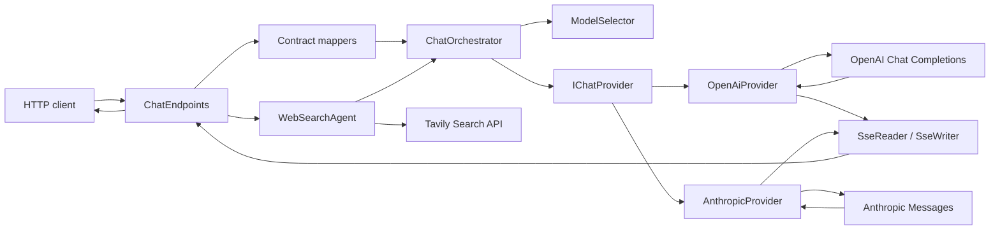
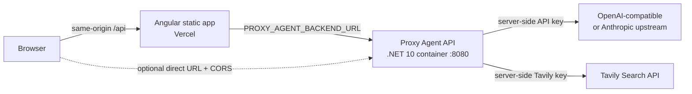

# Tài liệu kiến trúc

## Mục đích

Proxy Agent là HTTP gateway trên .NET 10, cung cấp một lớp gọi hội thoại thống nhất cho OpenAI và Anthropic. Gateway nhận request từ client, chọn provider theo model, chuyển đổi payload giữa các API, rồi trả response JSON hoặc stream SSE. Repo cũng có Angular chat UI để kiểm tra gateway bằng trình duyệt và deploy frontend tĩnh lên Vercel.

Anthropic được gọi qua Messages API; gateway không chạy tiến trình Claude Code CLI. Gateway có built-in server-side web search agent dùng Tavily và vẫn hỗ trợ client-side tool calling cho tool riêng.

## Sơ đồ tổng quát



## Kiến trúc deploy



`web/` chạy riêng với Angular dev-server khi phát triển. Khi production, Vercel serve `dist/web/browser`; rewrite `/api/*` vào function `api/index.ts`, function này proxy tới backend bằng biến server-side `PROXY_AGENT_BACKEND_URL`. Vercel luôn ép frontend dùng `/api`; `NG_APP_API_BASE_URL` chỉ dành cho deployment không phải Vercel muốn gọi trực tiếp backend qua CORS. Backend không được deploy như Vercel static asset, mà chạy bằng `Dockerfile` ở root repo hoặc một host container tương đương.

## Các tầng và trách nhiệm

### API layer

`src/ProxyAgent.Api/Api` chứa route và DTO bên ngoài:

- `ChatEndpoints.cs`: định nghĩa `/api/chat` và `/v1/chat/completions`.
- `ConversationEndpoints.cs`: tạo, đọc và cập nhật conversation server-backed cho link `/conversation/<id>`.
- `AdminEndpoints.cs`: login/logout/session và các endpoint cấu hình provider được bảo vệ bằng cookie policy.
- `GatewayContracts.cs`: schema normalized của gateway.
- `OpenAiContracts.cs`: schema tương thích OpenAI, bao gồm tên field snake_case.
- `ErrorHandling.cs`: đổi exception nội bộ thành HTTP status và error envelope ổn định.

Endpoint không gọi `HttpClient` trực tiếp. Nó chỉ map request, gọi orchestrator và serialize kết quả.

### Application/orchestration layer

`src/ProxyAgent.Application/Chat` chứa model chung và routing:

- `ChatModels.cs`: `NormalizedChatRequest`, `ChatMessage`, `ChatTool`, `ChatToolCall`, response và stream event.
- `ModelSelector.cs`: xử lý `openai:...`, `anthropic:...`, provider mặc định và model mặc định.
- `ChatOrchestrator.cs`: resolve provider từ `IChatProvider`, sau đó gọi `CompleteAsync` hoặc `StreamAsync`.
- `ChatPromptAgent.cs`: thêm `Chat:SystemPrompt` vào đầu request rồi chuyển tiếp sang web-search agent; đây là decorator nên endpoint không phải biết chi tiết prompt.
- `WebSearchAgent.cs`: đăng ký built-in `web_search`, chạy tool loop hoặc pre-search fallback tùy cấu hình rồi đưa context nguồn vào model.

Layer này không biết payload wire format của OpenAI hoặc Anthropic.

### Web search layer

`src/ProxyAgent.Application/WebSearch` tách phần truy cập Internet khỏi provider model:

- `TavilySearchProvider.cs`: gọi `POST https://api.tavily.com/search`, giới hạn số kết quả/nội dung và chỉ nhận URL `http`/`https`.
- `WebSearchAgent.cs`: lấy tool call từ model hoặc nhận diện câu hỏi cần dữ liệu mới, gọi search, rồi nối `role=tool` hoặc search context vào lượt model kế tiếp.
- `WebSearchContracts.cs`: options, search result và lỗi web search.

Tavily key mặc định đọc ở backend qua User Secrets/environment; trang admin có thể lưu override server-side vào storage. Search result được coi là dữ liệu tham khảo không đáng tin, không phải instruction.

### Provider/infrastructure layer

`src/ProxyAgent.Infrastructure/Providers` triển khai port `IChatProvider`:

- `OpenAiProvider.cs`: gọi `{BaseUrl}/chat/completions`, Bearer authentication, map Chat Completions response và stream chunk.
- `AnthropicProvider.cs`: gọi `{BaseUrl}/messages`, dùng `x-api-key`/`anthropic-version`, tách system message và map content blocks.
- `OpenAiPayloads.cs` và `AnthropicPayloads.cs`: DTO chỉ dành cho wire format upstream.
- `ProviderExceptions.cs`: phân loại provider chưa cấu hình, auth failure, request failure và upstream unavailable.

Mỗi provider dùng typed/named `HttpClient` được đăng ký trong `Program.cs`. API key không được ghi vào log.

### Streaming layer

`SseReader` đọc các event SSE từ upstream, hỗ trợ `event:`, nhiều dòng `data:` và event phân cách bằng dòng trống.

`SseWriter` chuyển normalized `ChatStreamEvent` thành:

- OpenAI chunk với `object: "chat.completion.chunk"`, kết thúc bằng `data: [DONE]`.
- Gateway event với `type: "delta"`, `type: "done"` hoặc `type: "error"`.

Cancellation từ `HttpContext.RequestAborted` được truyền xuống stream provider.

### Frontend layer

`web/src/app/presentation/shell/app.ts` giữ state của cuộc hội thoại và render màn hình chat. Các adapter HTTP, browser, storage và UI được tách trong `web/src/app/infrastructure`; luật dữ liệu chat/conversation/model nằm trong `web/src/app/domain`.

Frontend không giữ provider key của backend; custom model key trong phần Customize là tuỳ chọn local của trình duyệt và chỉ gửi tới model Base URL do người dùng nhập. Local dev dùng `proxy.conf.json` để chuyển `/health`, `/api` và `/v1` sang backend local; production gọi backend qua HTTPS. Nếu nhập Base URL `http://127.0.0.1:<port>` hoặc có hậu tố `/v1`, chat gọi thẳng 9Router từ trình duyệt; 9Router phải bật CORS cho origin của giao diện và cho phép `Authorization`/`Content-Type`. API conversation/share/admin vẫn dùng server API được sinh từ deployment, không bị chuyển sang localhost của model.

### Storage và admin

`ProxyAgent.Application` định nghĩa các port `IConversationStore`, `IAdminAccountStore` và `IBackendSettingsStore`; `ProxyAgent.Infrastructure/Storage` chứa các adapter; backend có adapter SQLite cho local/test, Redis cho production tạm thời và adapter `Npgsql` để chuyển lại sau này. `REDIS_URL` hoặc `Storage:Provider=redis` chọn Redis; `Storage:Provider=postgres` hoặc `ConnectionStrings:Postgres` chọn PostgreSQL. Các adapter nằm sau cùng một port nên đổi vendor database không lan sang endpoint/provider. Conversation lưu hash của owner token và cờ public, còn GET không có token chỉ trả bản ghi đã public. `AdminAuthService` chỉ seed tài khoản nếu chưa có account và đã nhận đủ `Admin:InitialUsername`/`Admin:InitialPassword`; mật khẩu lưu dưới dạng PBKDF2 hash. `BackendSettingsService` overlay override từ database đang chọn lên cấu hình environment/appsettings. Lỗi storage được trả về dưới dạng JSON `503 storage_unavailable` thay vì lỗi invocation không có nội dung.`

## Luồng request không streaming

1. Client gửi request vào một trong hai route.
2. Contract mapper kiểm tra message role và đổi DTO thành `NormalizedChatRequest`.
3. `ModelSelector` đọc model prefix:
   - `openai:gpt-4o-mini` → provider `openai`, model `gpt-4o-mini`.
   - `anthropic:claude-sonnet-4-5` → provider `anthropic`, model `claude-sonnet-4-5`.
4. `ChatPromptAgent` thêm system prompt cấu hình.
5. `WebSearchAgent` kiểm tra cấu hình và câu hỏi có cần dữ liệu web không.
6. Nếu dùng pre-search, agent gọi Tavily rồi thêm search context vào message; nếu dùng tool calling, agent đưa `web_search` vào tools và xử lý tool call.
7. `ChatOrchestrator` tìm provider tương ứng.
8. Provider map normalized request sang wire payload và gọi upstream.
9. Provider map response về `NormalizedChatResponse`.
10. Endpoint map normalized response về contract của route.

## Luồng streaming

Request vẫn dùng `stream: true`. Provider mở upstream response với `ResponseHeadersRead`, đọc từng SSE event và yield `ChatStreamEvent`.

Endpoint ghi mỗi event ngay vào response và flush. Với OpenAI-compatible route, event `IsDone` được đổi thành `[DONE]`; với gateway route, event done được ghi thành JSON event.

Nếu lỗi xảy ra trước khi response bắt đầu, gateway trả HTTP error bình thường. Nếu stream đã bắt đầu, gateway ghi một SSE error event rồi đóng stream vì HTTP status không còn thay đổi được.

## Tool calling và web search

Tool calling của client giữ nguyên luồng:

```text
Client gửi tools
    -> model trả tool call
    -> gateway trả tool call cho client
    -> client tự thực thi tool
    -> client gửi role=tool/tool result ở request kế tiếp
```

Mapping chính:

| Normalized | OpenAI | Anthropic |
|---|---|---|
| Tool definition | `tools[].function.parameters` | `tools[].input_schema` |
| Assistant call | `tool_calls` | `tool_use` block |
| Tool result | message `role: tool` | `tool_result` block trong message user |

Built-in `web_search` có hai chế độ:

- `WebSearch:UseToolCalling=true`: agent thêm tool definition vào request, nhận tool call từ OpenAI/Anthropic, gọi Tavily, thêm assistant tool-call và tool result vào lịch sử, rồi gọi model lại đến khi có câu trả lời cuối.
- `WebSearch:UseToolCalling=false`: phù hợp upstream OpenAI-compatible không hỗ trợ field `tools`; agent nhận diện câu hỏi hiện tại, gọi Tavily trước và gửi kết quả vào system context, không gửi field `tools` lên upstream.

Agent giới hạn số lần tool call và kích thước nội dung nguồn để tránh vòng lặp vô hạn và prompt quá lớn. Nó không chạy shell, không đọc file local và không mở trình duyệt.

## Routing và configuration

`Program.cs` bind các section `Routing`, `Providers` và `WebSearch`, đăng ký hai model provider cùng `TavilySearchProvider`, đồng thời cấu hình timeout HTTP.

`Cors:AllowedOrigins` là allowlist exact origin cho frontend. Môi trường production nên đặt bằng biến `Cors__AllowedOrigins__0`, ví dụ `https://your-project.vercel.app`; không dùng wildcard `*`.

Model selector dùng quy tắc:

1. Prefix `openai:` hoặc `anthropic:` có ưu tiên cao nhất.
2. Model không có prefix dùng `Routing:DefaultProvider`.
3. Model rỗng dùng `DefaultModel` của provider được chọn.
4. Provider chưa đăng ký trả `503 provider_not_configured`.

Base URL là API root; provider tự nối path resource:

```text
OpenAI:    {BaseUrl}/chat/completions
Anthropic: {BaseUrl}/messages
```

## Error model

Response lỗi có dạng:

```json
{
  "error": {
    "code": "provider_unavailable",
    "message": "The upstream provider is unavailable.",
    "provider": "openai"
  }
}
```

Các mã chính: `invalid_request`, `unsupported_provider`, `provider_not_configured`, `provider_authentication_failed`, `provider_request_failed`, `provider_unavailable`, `web_search_failed`.

## Testing architecture

Test project dùng ba lớp kiểm tra:

- Unit tests cho model selector, provider mapping và SSE parser/writer.
- Provider tests dùng `HttpMessageHandler` giả để kiểm tra request/response mà không gọi mạng thật, bao gồm payload Tavily.
- Endpoint tests dùng `WebApplicationFactory` và `FakeChatProvider` để kiểm tra routing, response shape, streaming và error status.
- Web search agent tests kiểm tra cả tool loop và pre-search fallback.

Không test nào cần API key thật.

## Giới hạn MVP và hướng mở rộng

SQLite persistence hiện được giữ cho local/test; production dùng PostgreSQL cho tài khoản admin, backend settings và các conversation đã được người dùng chia sẻ. Lịch sử chat chưa chia sẻ chỉ nằm trên thiết bị, nên PostgreSQL tạm thời không khả dụng cũng không được làm hỏng luồng chat; backend dùng cấu hình environment/appsettings và frontend giữ dữ liệu local để thử chia sẻ lại sau. Vẫn chưa có client authentication, rate limiting hoặc browser-style page crawling. Web search hiện dùng kết quả và raw Markdown content do Tavily trả về.

Các extension point đã có sẵn:

- Thêm provider mới bằng cách triển khai `IChatProvider` và đăng ký DI.
- Thêm server-side tools khác bằng registry/executor riêng ở application layer.
- Thêm authentication/rate limiting ở ASP.NET Core pipeline mà không thay đổi provider adapter.
